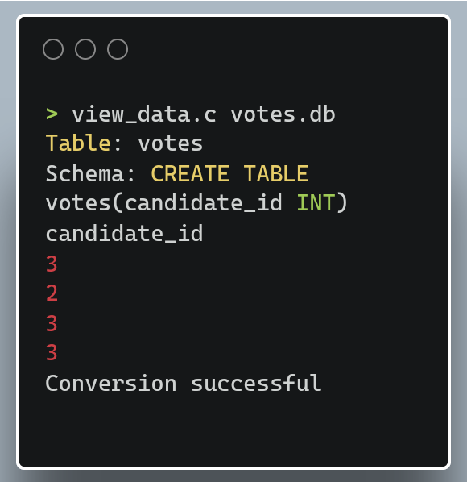
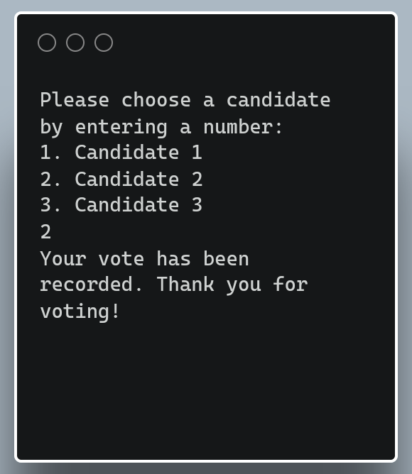

# MINI VOTING SYSTEM
<br />
This is a mini voting system built with ♥️ the powers of c and SQlite it is built using chromebook.


## FILE TREE

```
----root
  |
  |----sqlite
  |       |----sqlite3.h
  |       |----sqlite3.c
  |       |----sqlite3ext.h
  |       |----shell.c
  |
  |----main.c
  |----view_data.c
  |----votes.db
  |----Lisence
__|__
```

## LISCENSE


YOU ARE WARMLY ALLOWED TO MAKE CHANGES IN THIS PROJECT AND TAKE IT TO PRODUCTION LEVEL.

## SCREENSHOTS



<br />



# SOCIAL

(https://mobile.twitter.com/_Arkaneel_Roy_)


